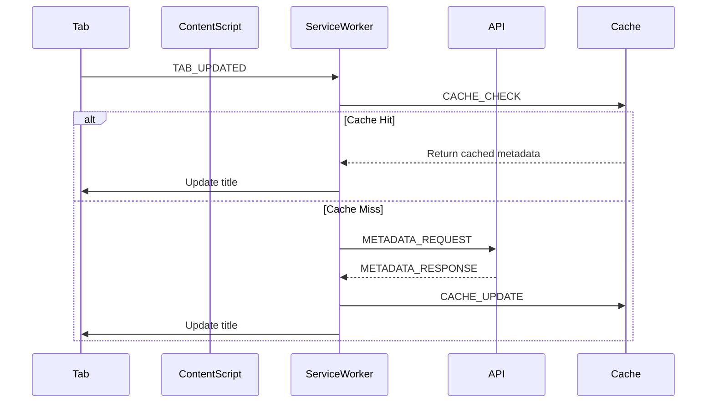
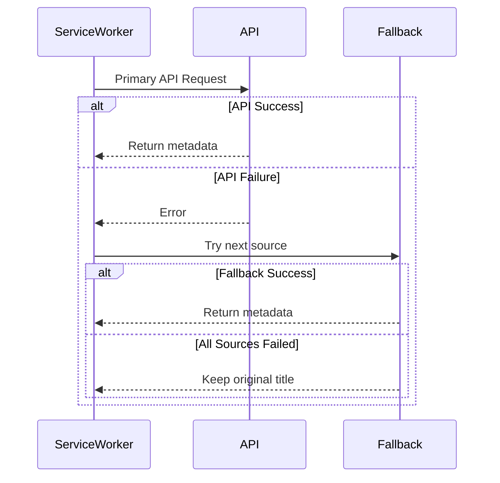

# Component Communication Flow

## Message Types

### 1. Tab Events
```typescript
interface TabUpdateMessage {
  type: 'TAB_UPDATED';
  tabId: number;
  url: string;
  status: 'loading' | 'complete';
}

interface TabActivatedMessage {
  type: 'TAB_ACTIVATED';
  tabId: number;
  windowId: number;
}
```

### 2. Metadata Events
```typescript
interface MetadataRequestMessage {
  type: 'METADATA_REQUEST';
  url: string;
  tabId: number;
  source: 'arxiv' | 'openreview' | 'pdf';
}

interface MetadataResponseMessage {
  type: 'METADATA_RESPONSE';
  success: boolean;
  data?: PaperMetadata;
  error?: APIErrorResponse;
  tabId: number;
}
```

### 3. Cache Events
```typescript
interface CacheCheckMessage {
  type: 'CACHE_CHECK';
  url: string;
}

interface CacheUpdateMessage {
  type: 'CACHE_UPDATE';
  url: string;
  data: PaperMetadata;
}
```

## Communication Flow Diagram


## Error Handling Flow


## State Management

### 1. Tab State
```typescript
interface TabState {
  id: number;
  url: string;
  status: 'loading' | 'complete' | 'error';
  metadata?: PaperMetadata;
  lastUpdate: number;
  retryCount: number;
}

class TabStateManager {
  private tabs: Map<number, TabState>;
  
  public updateTab(tabId: number, update: Partial<TabState>): void;
  public getTab(tabId: number): TabState | undefined;
  public cleanupTabs(): void;  // Remove old/closed tabs
}
```

### 2. Request State
```typescript
interface RequestState {
  pending: Set<string>;  // URLs in process
  failed: Map<string, APIErrorResponse>;
  retryQueue: RequestQueueItem[];
}

class RequestStateManager {
  private state: RequestState;
  
  public addPendingRequest(url: string): void;
  public markRequestComplete(url: string, success: boolean): void;
  public shouldRetry(url: string): boolean;
}
```

## Event Listeners

### 1. Tab Events
```typescript
// In background.js
chrome.tabs.onUpdated.addListener((tabId, changeInfo, tab) => {
  if (changeInfo.status === 'complete' && isPaperURL(tab.url)) {
    handleTabUpdate({ type: 'TAB_UPDATED', tabId, url: tab.url, status: 'complete' });
  }
});

chrome.tabs.onActivated.addListener(({ tabId, windowId }) => {
  handleTabActivation({ type: 'TAB_ACTIVATED', tabId, windowId });
});
```

### 2. Message Handlers
```typescript
// In background.js
chrome.runtime.onMessage.addListener((message, sender, sendResponse) => {
  switch (message.type) {
    case 'METADATA_REQUEST':
      handleMetadataRequest(message).then(sendResponse);
      return true;  // Will respond asynchronously
    case 'CACHE_CHECK':
      handleCacheCheck(message).then(sendResponse);
      return true;
    default:
      console.warn('Unknown message type:', message.type);
  }
});
```

## Performance Optimizations

### 1. Batch Processing
```typescript
class BatchProcessor {
  private batch: MetadataRequestMessage[] = [];
  private timeout: NodeJS.Timeout | null = null;
  
  public add(request: MetadataRequestMessage): void {
    this.batch.push(request);
    this.scheduleBatchProcessing();
  }
  
  private async processBatch(): Promise<void> {
    // Process similar requests together
    const arxivRequests = this.batch.filter(r => r.source === 'arxiv');
    if (arxivRequests.length > 0) {
      await this.processArxivBatch(arxivRequests);
    }
    // ... handle other sources
  }
}
```

### 2. Priority Queue
```typescript
class PriorityQueue {
  private queue: RequestQueueItem[] = [];
  
  public add(item: RequestQueueItem): void {
    this.queue.push(item);
    this.sort();
  }
  
  private sort(): void {
    this.queue.sort((a, b) => {
      // Prioritize:
      // 1. Active tab requests
      // 2. Visible tab requests
      // 3. Lower retry counts
      return b.priority - a.priority;
    });
  }
}
``` 